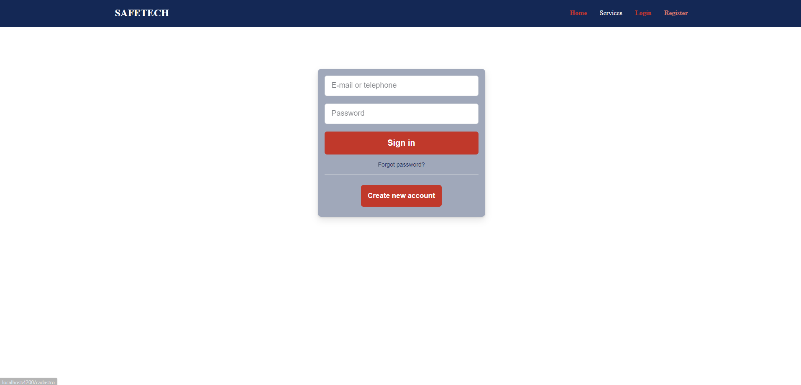

  

<h1 align="center">Projeto em Angular</h1> 

•<a href="#-sobre-o-projeto"> Sobre</a> •
 <a href="#-ferramentas">Ferramentas</a> •
 <a href="#-como-executar-o-projeto">Como executar</a> • 
 <a href="#-visualização">Visualização</a> • 

---

## 💻 Sobre o projeto
Um projeto simples para testar os meus conhecimentos dentro do framework 

---

## 🛠 Ferramentas
As seguintes ferramentas foram usadas na construção do projeto:
- Angular
- Typescript
- Json-Server
- Scss

---

## 🚀 Como executar o projeto
**Basta fazer os seguintes passos...**

- Basta instalar as dependências na pasta `backend` e na pasta `frontend` do projeto usando:
> `npm install `

- E para rodar o projeto:
> `npm run start`

---

## 👀 Visualização

**
Tela inicial
**

**
Tela login
**

**
Tela cadastro
**

